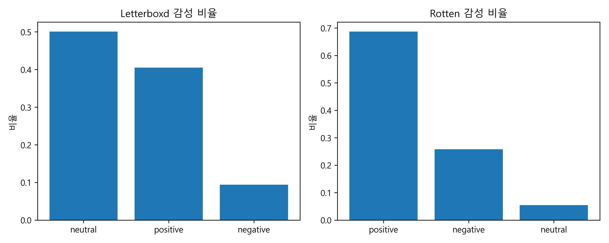
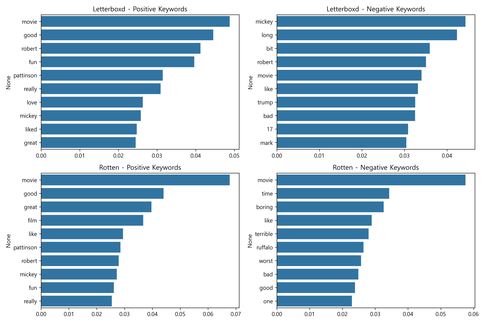
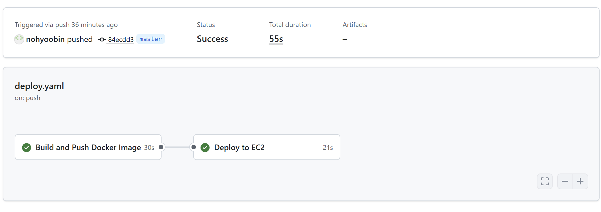
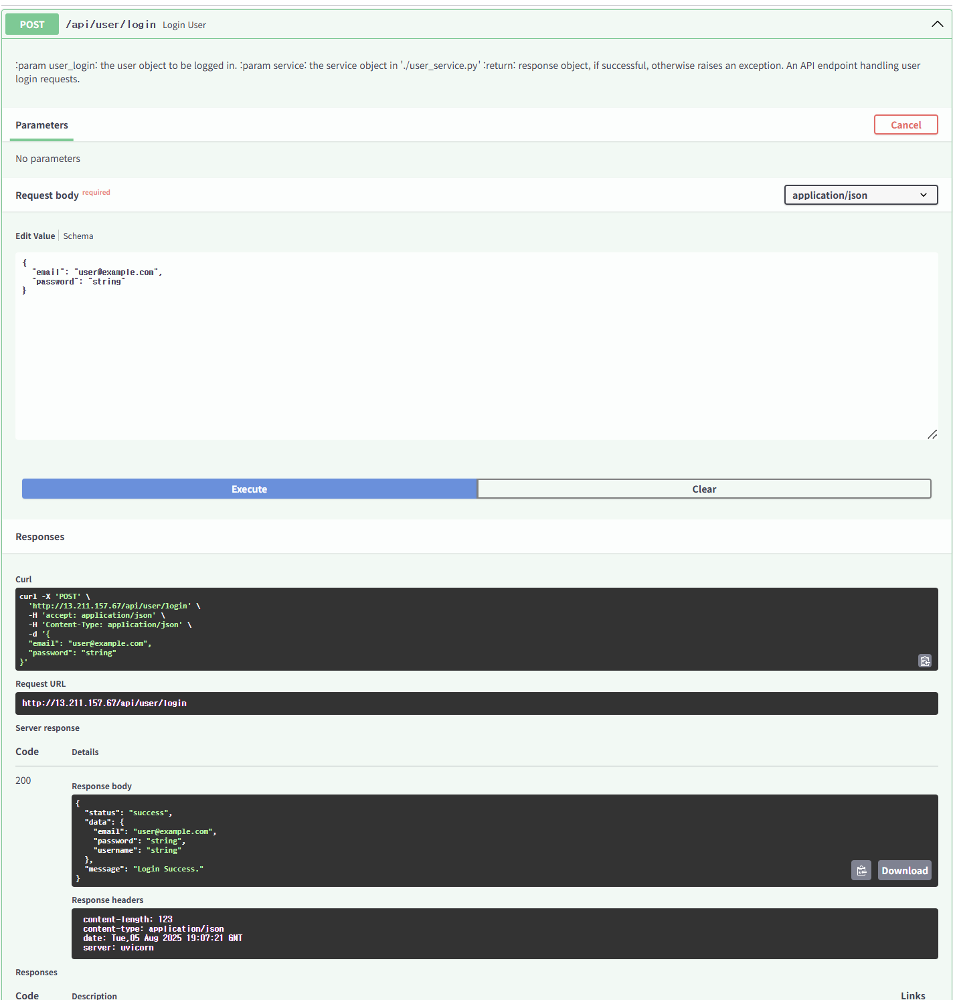
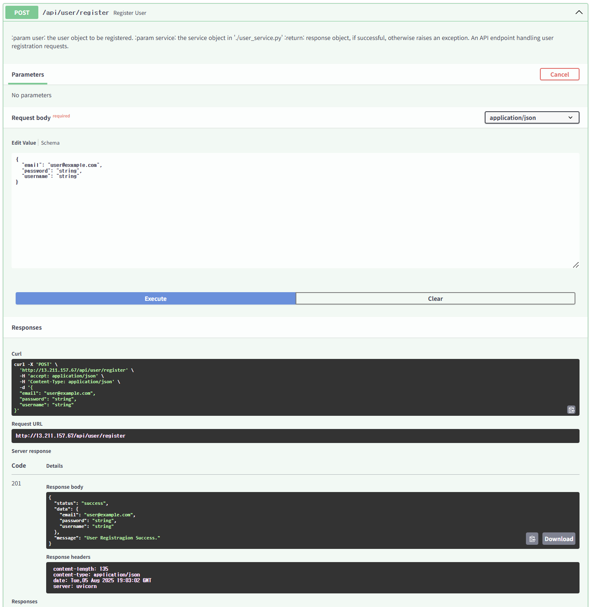
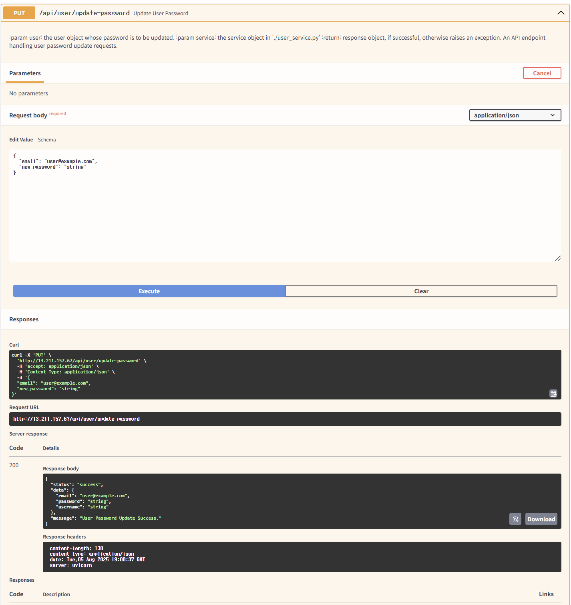
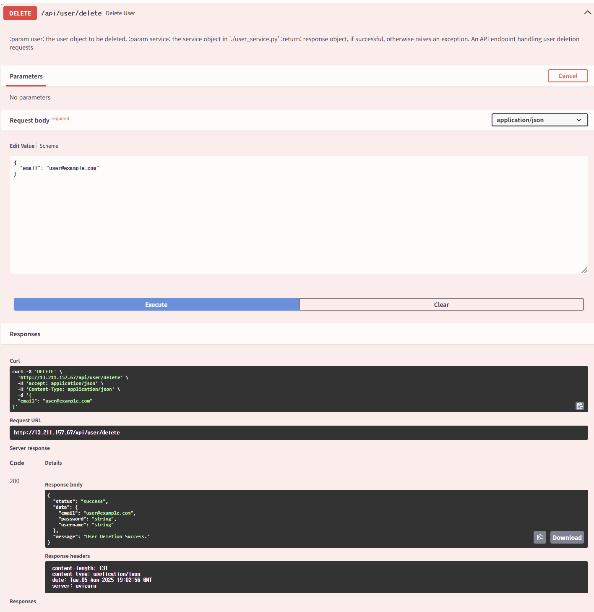
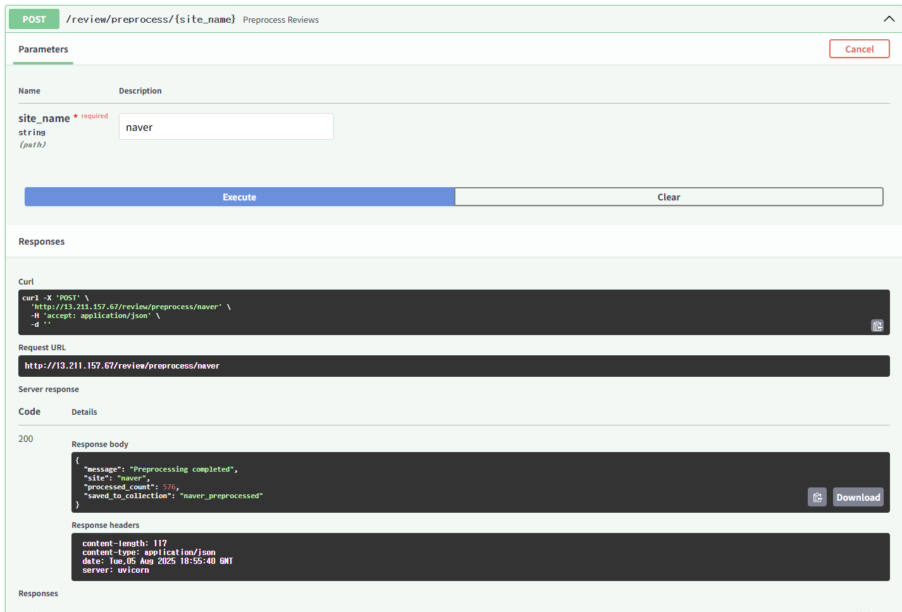

# 👨‍💻 YBIGTA 27기 팀플 3조

안녕하세요! YBIGTA 27기 팀플 **3조**입니다!!

## 👤 자기소개
### 🙋‍♂️ 노유빈
- 이름: **노유빈**
- 학번: **22학번**
- 전공: **전기전자공학과**
- MBTI: **ESTP**

호기심 많고 도전적인 성격으로, 새로운 기술이나 프로젝트를 빠르게 습득하고 실전에서 적용하는 걸 좋아합니다.  
YBIGTA를 통해 함께 배우고 성장해나가고 싶습니다!

### 🙋‍♂️ 문영운
- 이름: **문영운**
- 학번: **20학번**
- 전공: **문헌정보학과**
- MBTI: **ISTP**

쉽게 넘기지 않고, 끝까지 파고드는 분석 습관이 저의 강점입니다.
함께 고민하며 성장하는 YBIGTA의 일원이 되고 싶습니다.


### 🙋‍♂️ 이재열
- 이름: **이재열**
- 학번: **24학번**
- 전공: **컴퓨터과학과**
- MBTI: **ISTP**

깊은 이론적 배경지식과 열정을 가지고 있습니다.
YBIGTA에서 하는 많은 프로젝트를 통해 성장하고 싶습니다.

<br> </br>

<details>
<summary> 🧩 Web 과제 - FastAPI 기반 사용자 관리 시스템 </summary>

# 🧩 Web 과제 - FastAPI 기반 사용자 관리 시스템

이 프로젝트는 FastAPI를 기반으로 한 사용자 로그인/회원가입 시스템입니다.  
MVC 패턴을 적용하여 구조를 나누었고, HTML 인터페이스를 포함해 실제 사용 가능한 미니 웹 서비스를 구현했습니다.

### 📁 프로젝트 구조
```
YBIGTA_newbie_team_project/
├── app/
│ ├── main.py # FastAPI 실행 엔트리포인트
│ ├── static/index.html # 사용자 인터페이스 (디자인 포함)
│ ├── user/
│ │ ├── user_router.py # Controller 역할
│ │ ├── user_service.py # Service 역할
│ │ ├── user_repository.py # Repository 역할
│ │ └── user_schema.py # DTO (Pydantic models)
│ └── responses/base_response.py
├── database/users.json # 가상의 유저 DB
├── tests/ # pytest 기반 테스트
│ ├── test_user_router.py
│ └── test_user_service.py
├── requirements.txt
```

## 🎨 index.html 꾸민 내용

- YBIGTA 로고 및 전체 UI 디자인 추가
- 로그인/회원가입 폼 스타일 개선
- 배경 그라데이션, 버튼 스타일, 사용자 환영 메시지 구현
- 비밀번호 변경 및 계정 삭제 인터페이스 구현

---
## 🚀 코드 실행 방법

### 1. 의존성 설치
```bash
pip install -r requirements.txt
```

### 2. FastAPI 서버 실행
```bash
uvicorn app.main:app --reload
```

### 3. 접속 확인
- http://localhost:8000  
- Swagger 문서: http://localhost:8000/docs

<br> </br>


# 🎬 Mickey 17 (2025) Review Crawlers

**Selenium + BeautifulSoup** 기반 크롤러 3종을 통해  
**Rotten Tomatoes, Naver Movie, Letterboxd**의 유저 리뷰 데이터를 수집합니다.

---

## 📌 공통 기능

- 🎞️ 대상 영화: **Mickey 17 (2025)**
- 📦 사용 기술: `Selenium`, `BeautifulSoup`, `pandas`, `webdriver-manager`
- ✅ 각 사이트별 리뷰 **500개 이상 자동 수집**
- 💾 출력 형식: `score`, `date`, `review` 컬럼을 포함한 **CSV 파일** 저장  
- 📁 저장 위치: `database/reviews_사이트이름.csv`
- 🛠️ 실행 방식:

    ```bash
    # 필수 패키지 설치
    pip install selenium webdriver-manager beautifulsoup4 pandas

    # 크롤링 명령어
    python review_analysis/crawling/main.py -o database -c [사이트이름]
    ```

    예시:

    ```bash
    python review_analysis/crawling/main.py -o database -c rotten
    python review_analysis/crawling/main.py -o database -c naver
    python review_analysis/crawling/main.py -o database -c letterboxd
    ```

---

## 💡 사이트별 크롤링 특징 및 데이터 소개

### 🍅 Rotten Tomatoes

- 🔗 [리뷰 페이지 링크](https://www.rottentomatoes.com/m/mickey_17/reviews?type=user)
- 🔁 `"Load More"` 버튼 최대 30회 클릭 자동화
- 🌐 미국 사이트 특성상 영어 리뷰가 다수
- ✅ 간결하고 깔끔한 HTML 구조
- 데이터 형식 `df.dtypes`
    | Column | Data Type |
    |--------|-----------|
    | scor   | float64     |
    | date   | object    |
    | review | object    |
- 데이터 개수 `df.shape` : (620, 3)

**출력 예시:**
```
score,date,review
3.5,"Jul 17, 2025","Amazing movie! Loved the cast..."
```

---

### 🎥 Naver Movie

- 🔗 [관람평 페이지 링크](https://search.naver.com/search.naver?where=nexearch&sm=tab_etc&mra=bkEw&pkid=68&os=29816634&qvt=0&query=미키%2017%20관람평)
- 🔄 **최신순 + 공감순** 정렬 리뷰를 병합 수집
- 📜 **무한 스크롤** 방식 구현 (각 정렬 기준 최대 300개 수집)
- 🚫 중복 리뷰 자동 제거 포함
- ⚠️ HTML 구조가 자주 변경되므로 유지보수 필요

- 데이터 형식 `df.dtypes`
    | Column | Data Type |
    |--------|-----------|
    | star   | int64     |
    | date   | object    |
    | text   | object    |
- 데이터 개수 `df.shape` : (576, 3)


**출력 예시:**
```
date,rating,text
2025-02-28,10,"외계인 생물도 뻥카를 칠 수있다."
2025-03-01,8,"로버튼 패티슨의 1인 2역은 신의 한수다..."
```

---

### 📦 Letterboxd

- 🔗 [리뷰 페이지 링크](https://letterboxd.com/film/mickey-17/reviews/)
- ⭐ 별점 환산: ★ 개수와 ½ 문자를 파싱해 10점 만점 점수로 변환
- 🗓️ ISO 날짜 추출: <time datetime="…"> 속성에서 정확한 날짜 정보 획득
- 💾 CSV 저장: utf-8-sig 인코딩으로 reviews_letterboxd.csv 파일 생성 (pathlib 사용)
- 🕘 최신순 추출: 최신 리뷰 순서대로 추출
- 데이터 형식 `df.dtypes`
    | Column | Data Type |
    |--------|-----------|
    | star   | int64     |
    | date   | object    |
    | text   | object    |
- 데이터 개수 `df.shape` : (500, 3)

**출력 예시:**
```
star,date,text
6,2025-04-26,Cool concept and some funny moments but drags on WAYYYY too long
10,2025-07-23,The relationship between Nasha and the two Mickeys gave Challengers energy.
```

---

## 📂 관련 디렉토리 구조

```text
review_analysis/
└── crawling/
    ├── base_crawler.py              # 크롤러 상속 기반 클래스
    ├── RottenTomatoesCrawler.py     # Rotten Tomatoes 크롤러
    ├── naver_movie_crawler.py       # Naver Movie 크롤러
    ├── letterboxd_crawler.py        # Letterboxd 크롤러
    └── main.py                      # 크롤링 실행 진입점
database/
    ├── reviews_rotten.csv
    ├── reviews_naver.csv
    └── reviews_letterboxd.csv
```


<br> </br>

# 🧪 Mickey 17 (2025) Review Preprocessing

**세 리뷰 사이트(Rotten Tomatoes, Naver Movie, Letterboxd)**로부터 수집한 데이터를 통일된 형식으로 전처리하고,  
텍스트 정제 및 날짜 기반 피처 엔지니어링을 수행하여 분석 가능한 형태의 CSV 파일로 저장합니다.

---

## 📌 공통 처리 내용

- 📄 컬럼 통일: `date`, `rating`, `review` 순으로 정렬  
- 🗓️ 날짜 형식 정제: 다양한 형식을 `YYYY-MM-DD`로 통일  
- 🧹 텍스트 정제: 소문자화, 특수문자 제거, 불용어 제거 등 사이트별 최적화 처리  
- 🧠 파생 변수 생성: `year`, `month`, `weekday`, `final_review` 컬럼 추가  
- 💾 전처리된 CSV 파일은 `database/preprocessed_reviews_사이트이름.csv`로 저장됨

---

## 💡 사이트별 전처리 차이점

### 🍅 Rotten Tomatoes
- `score` 컬럼을 **5점 만점 → 10점 만점**으로 환산  
- 날짜 형식 `"Jul 21, 2025"` → `"2025-07-21"`로 변환  
- 영어 텍스트를 소문자 처리 + 특수문자 제거  
- TF-IDF 벡터화 수행 (단, **벡터 저장은 생략**)

### 🎥 Naver Movie
- `rating` 컬럼에서 숫자 추출 및 유효 범위(0~10) 내 정제  
- 리뷰 길이가 **20~1000자 사이인 데이터만 유지**  
- 한글 리뷰에서 **특수문자/영어 제거** 및 **다중 공백 제거**  
- TF-IDF 벡터화 결과를 `.npz`, `.npy` 파일로 저장 (**실행 시 생성됨**)

### 📦 Letterboxd
- 영어 리뷰를 소문자 처리 후 특수문자 제거  
- 불용어(stopwords) 제거로 텍스트 정제  
- TF-IDF는 임시 비활성화 (필요시 주석 해제 가능)

---

## 🛠️ 실행 방법

```bash
# 모든 사이트 전처리 일괄 실행
python -m review_analysis.preprocessing.main --all

# 특정 사이트만 실행 (예: Rotten Tomatoes)
python -m review_analysis.preprocessing.main -c reviews_rotten
```

---

## 📂 전처리 파일 구조

```text
review_analysis/
└── preprocessing/
    ├── base_preprocessor.py            # 공통 추상 클래스
    ├── rotten_preprocessor.py          # Rotten 리뷰 전처리
    ├── naver_preprocessor.py           # Naver 리뷰 전처리
    ├── letterboxd_preprocessor.py      # Letterboxd 리뷰 전처리
    └── main.py                         # 전처리 실행용 진입점
database/
    ├── preprocessed_reviews_rotten.csv
    ├── preprocessed_reviews_naver.csv
    ├── preprocessed_reviews_letterboxd.csv
    ├── vector_matrix_tfidf.npz         # 🔄 (Naver 전처리 실행 시 자동 생성)
    └── vocab_tfidf.npy                 # 🔄 (Naver 전처리 실행 시 자동 생성)
```

> ⚠️ `.npz`, `.npy` 파일은 GitHub에 포함되어 있지 않으며,  
> `NaverPreprocessor`를 실행하면 자동 생성됩니다.

# 📊 EDA

## 📊 사이트별 리뷰 EDA

---

## 🎥 Naver Movie

### 1️⃣ 일별 리뷰 수 추이  
.png)  
- 리뷰가 **짧은 기간에 집중**  
- **주말과 주초**에 급증하는 경향

### 2️⃣ 요일별 리뷰 수  
%20(Naver).png)  
- **월·금·토·일**에 리뷰가 많음  
- **화~목**은 상대적으로 적음 → 감상 후 일정 지연 반영

### 3️⃣ 월별 리뷰 수  
.png)  
- 리뷰가 **3~4월에 몰림**  
- 개봉 직후 반응 집중 현상

### 4️⃣ 평점 분포  
.png)  
- **8~10점**에 분포 집중 → 전반적으로 **긍정적 평가 우세**  
- 일부 **악평(0~3점)**도 존재

### 5️⃣ 리뷰 길이 vs 평점  
.png)  
- 상관계수 **+0.08** → **거의 무상관**  
- 긴 리뷰라고 해서 고평점인 것은 아님

### ✍️ 요약  
→ 리뷰는 **개봉 직후 + 주말 중심**으로 몰리며 전반적으로 **긍정적 평가가 많음**.  
리뷰 길이와 평점은 명확한 상관 없음.

---

## 🍅 Rotten Tomatoes

### 1️⃣ 일별 리뷰 수 추이  
.png)  
- **4월 초 집중**, **5~6월 재상승**  
- 개봉 초기 반응과 후속 관심 시점 존재

### 2️⃣ 요일별 리뷰 수  
%20(Rotten).png)  
- **월요일·일요일** 리뷰 집중  
- **금요일** 리뷰 수 가장 적음

### 3️⃣ 월별 리뷰 수  
.png)  
- **4월 리뷰 집중**, 이후 점차 감소

### 4️⃣ 평점 분포  
.png)  
- **7~10점**이 우세하나  
- **저평점 분포도 존재** → **호불호 강한 영화로 해석 가능**

### 5️⃣ 리뷰 길이 vs 평점  
.png)  
- 상관계수 **+0.083** → **무상관**

### ✍️ 요약  
→ 개봉 후 특정 시점 반응 집중, **긍정 평가 우세하나 호불호 뚜렷**.  
리뷰 길이와 평점 관계는 없음.

---

## 📦 Letterboxd

### 1️⃣ 일별 리뷰 수 추이  
.png)  
- 리뷰 대부분 **7월 말 집중**  
- 수집 시점의 영향 반영

### 2️⃣ 요일별 리뷰 수  
%20(Letterboxd).png)  
- **월요일 리뷰 최다**  
- 수집 날짜와 겹칠 가능성

### 3️⃣ 월별 리뷰 수  
.png)  
- 리뷰의 **7월 집중 현상** → 최신 리뷰 중심 수집 결과

### 4️⃣ 평점 분포  
.png)  
- **6~8점**에 집중 → **온건한 긍정 평가 경향**

### 5️⃣ 리뷰 길이 vs 평점  
.png)  
- 상관계수 **-0.021** → **무상관**

### ✍️ 요약  
→ 최근 리뷰 위주 수집으로 특정 시기 집중,  
전반적으로 **긍정적 평가** 비중 높고, 리뷰 길이와 평점 관계는 없음.

---

## 📊 사이트 간 리뷰 비교 분석

### 1️⃣ 일별 리뷰 수 비교  
  
- Naver: **3~4월 집중**  
- Rotten: **4~5월 고르게 분포**  
- Letterboxd: **7월 급격한 증가**

### 2️⃣ 누적 리뷰 수 비교  
  
- Naver: 빠른 초반 증가  
- Rotten: **전체 리뷰 수 가장 많음**  
- Letterboxd: **단기간 폭발적 증가**

> 📌 요약  
> 수집 시기와 크롤링 시점이 리뷰 수 추이에 큰 영향  
> 단순 비교보다는 **시계열 흐름 고려 필요**

### 3️⃣ 요일별 리뷰 수 비교  
  
- Letterboxd: **화요일 집중 (수집일 영향)**  
- Naver: **주말 + 목요일 집중**  
- Rotten: **요일별 분산 뚜렷**

### 4️⃣ 평점 분포 비교  
  
- Naver: **긍정 평가 강함**  
- Letterboxd: **보통 이상 평가 중심**  
- Rotten: **고른 분포, 비판 성향 강함**

### 5️⃣ 리뷰 길이 분포 비교  
.png)  
- Rotten: **가장 긴 리뷰**  
- Naver: **가장 짧은 리뷰**  
→ **언어 및 플랫폼 문화에 따라 길이 차이 존재**

### 6️⃣ 평균 평점 및 분산 비교  


| 플랫폼         | 평균 평점 | 표준편차 |
|----------------|-----------|-----------|
| Letterboxd     | **7.29**  | **1.68**  |
| Naver          | 6.64      | 2.92      |
| Rotten         | 5.91      | 3.01      |

> ✍️ Letterboxd는 **일관된 긍정 평가**, Rotten은 **다양한 의견 분포**  
> 단순 평균보다는 **분산 포함 해석 필요**

---

## 🧠 플랫폼별 TF-IDF 키워드 분석

### 1️⃣ 플랫폼별 상위 TF-IDF 키워드 비교  


| 플랫폼 | 주요 키워드 | 해석 |
|--------|--------------|------|
| **Letterboxd** | `robert`, `pattinson`, `filme`, `que`, `de`, `la` | 배우 중심, 비영어권 단어 혼재 |
| **Naver** | `너무`, `진짜`, `정말`, `봉준호`, `미키` | 감탄 표현 + 감독/배우 언급 |
| **Rotten** | `good`, `movie`, `film`, `great`, `story` | 전형적인 영어 리뷰 키워드 |

> ✍️ 플랫폼마다 **표현 방식과 감상 중심이 다름**  
> 감성적 서술 (Naver), 배우 중심 (Letterboxd), 평가 중심 (Rotten)

---

## 💬 감성 분석 기반 TF-IDF 키워드 비교

### 1️⃣ 감성 분포 요약  


| 플랫폼 | 긍정 | 중립 | 부정 |
|--------|------|------|------|
| Letterboxd | 약 40% | 약 50% | 약 10% |
| Rotten     | **약 70%** | 약 5% | 약 25% |

> Letterboxd는 **중립/긍정 혼합형 감성**,  
> Rotten은 **명확한 긍/부정 감성 판단**이 특징

### 2️⃣ 감성별 키워드 비교  


| 플랫폼 | 감성 | 주요 키워드 |
|--------|------|-------------|
| Letterboxd | 긍정 | `love`, `good`, `robert`, `pattinson` |
| Letterboxd | 부정 | `long`, `bad`, `bit`, `trump`, `mickey` |
| Rotten     | 긍정 | `great`, `liked`, `fun`, `really` |
| Rotten     | 부정 | `boring`, `worst`, `terrible`, `bad` |

> ✍️ 감성별 키워드를 통해 플랫폼의 **표현 방식 + 리뷰 문화 차이**를 시각적으로 확인 가능

</details>


# docker hub 주소
**Docker Hub Repository**: https://hub.docker.com/repository/docker/nohyoobin/ybigta-app/general

# 📸 AWS 과제 수행 증명 사진

# 1. 🐳 GitHub Actions CI/CD 파이프라인



### 2. 🔐 사용자 로그인 API



### 3. 📝 사용자 등록 API



### 4. 🔄 비밀번호 변경 API



### 5. 🗑️ 사용자 삭제 API



### 6. 🔧 리뷰 전처리 API



# Trouble Shooting & 배운점
## ⚙️ Troubleshooting

### 1. EC2 + Docker + FastAPI 배포 이슈

- **ERR_CONNECTION_REFUSED 오류**
  - 원인: EC2 보안 그룹의 80번 포트 미개방
  - 해결: 인바운드 규칙에 80포트 (0.0.0.0/0) 허용 추가

- **FastAPI 내부 포트 불일치**
  - 원인: 도커 외부 80포트와 FastAPI 내부 8000포트 불일치
  - 해결: `--port 80`으로 uvicorn 실행 포트 통일

- **환경변수 미적용**
  - 원인: `--env-file .env` 옵션 누락
  - 해결: 옵션 추가하여 환경변수 적용

- **RDS 엔드포인트 오류**
  - 원인: 오타, 삭제, 퍼블릭 액세스 미허용
  - 해결: 퍼블릭 액세스=Yes, 엔드포인트 복사 확인

- **DB 스키마 불일치**
  - 원인: 코드에는 있으나 DB에 없는 컬럼 (예: password)
  - 해결: SQL로 직접 컬럼 추가

- **MySQL 접속 오류**
  - 원인: 비번 오타, DB명 오타, DB 미생성 등
  - 해결: 비밀번호 재설정, DB 생성 및 이름 규칙 준수

- **User Not Found (400/404)**
  - 원인: 실제 유저가 없는 경우로, 정상 동작임

### 2. MongoDB Atlas & 전처리 API 구현

- **데이터 덮어쓰기 오류**
  - 원인: 전처리 결과가 원본을 덮어씀 → 컬럼 수 mismatch
  - 해결: `{site_name}_preprocessed`에 별도 저장

- **Naver 리뷰 데이터 품질 문제**
  - 원인: 날짜/평점 형식이 통일되지 않음
  - 해결: 전처리 단계에서 정제 함수 추가

- **NLTK 의존성 제거**
  - 이유: 과도한 외부 의존성 제거

### 3. Docker 환경 이슈

- **requirements.txt 누락**
  - 원인: pandas, sklearn 등 빠짐
  - 해결: 의존성 재작성

- **환경변수 변경 후 미반영**
  - 원인: 컨테이너 재시작 미실행
  - 해결: 컨테이너 재시작으로 적용

### 4. 테스트 환경 문제

- **pytest 환경 불일치**
  - 원인: 기본 anaconda3 환경에서 실행
  - 해결: 가상환경(ybigta)에서 pytest 실행

### 🧠 개념 정리

- **MySQL vs MongoDB**
  - MySQL: 정형 데이터 (예: 유저 정보)
  - MongoDB: 비정형 문서 데이터 (예: 리뷰)

- **Docker**
  - 실행 환경을 통일하는 배포 도구

- **AWS 인프라**
  - EC2: 가상 서버
  - RDS: 관리형 MySQL
  - Security Group: 네트워크 접근 제어

- **환경변수 (.env)**
  - 민감정보 및 설정 일괄 관리

- **RESTful API & FastAPI**
  - HTTP 기반 API, JSON 입출력

- **데이터 전처리**
  - 정제, 형식 통일, 결측값 처리 등

- **테스트 자동화**
  - pytest로 CRUD 및 API 테스트 실행

## 📝 배운 점

### EC2 + Docker + FastAPI 배포

- 보안 그룹 인바운드 규칙 누락이 자주 발생한다.
- 포트 불일치 시 접속 안 된다. 실행 포트를 일치시켜야 한다
- `.env` 누락은 치명적이다. 적용 여부 확인 필수
- 도커 컨테이너가 잘 돌아가도 네트워크가 막히면 접속 안 된다

### RDS + MySQL 연동

- 엔드포인트는 항상 복붙. 오타 잦음
- 퍼블릭 액세스, 보안 그룹 설정 안 하면 연결 불가
- DB 필드와 코드가 다르면 장애 발생

### MongoDB Atlas + 리뷰 저장

- IP 허용 설정 안 하면 아무것도 안 됨
- 날짜, 평점 등 형식 불일치가 많아 정제가 필수
- 전처리 결과는 원본과 분리 저장이 안정적.
- NLTK 등 외부 의존성은 줄이는 게 좋음

### 테스트 및 개발 환경

- 가상환경과 테스트 환경이 다르면 깨짐
- `requirements.txt`는 전 환경을 커버해야 함
- 테스트는 버그 추적 속도를 크게 줄여준다
- `.env` 변경 시 컨테이너 재시작이 필수

### 전체 프로젝트 운영

- 에러 메시지가 유념해서 보기 + 공식문서와 로그 체크
- 단계를 쪼개서 점검하는 게 가장 빠르다.
- 로컬과 배포 환경은 다르다. 별개로 확인 필요

# 🤖 RAG Agent 과제 - LangGraph 기반 멀티노드 챗봇 시스템

## 📋 과제 개요

이번 과제는 **RAG(Retrieval-Augmented Generation)**와 **Agent** 기술을 활용하여 수집한 영화 리뷰 데이터를 바탕으로 지능형 챗봇을 구현하는 것이 목표입니다.

### 🎯 핵심 요구사항
- **3개의 전문 노드**: Chat Node, Subject Info Node, RAG Review Node
- **LangGraph 기반 조건부 라우팅**: LLM이 판단하여 유동적 라우팅
- **Streamlit Cloud 데모**: 실제 서비스 가능한 웹 인터페이스
- **실제 데이터 활용**: 수집된 영화 리뷰 데이터 기반

---

## 🏗️ 시스템 아키텍처

### 📊 전체 시스템 구조
```
사용자 입력 → LangGraph Router → 전문 노드 → 응답 생성 → Chat Node 복귀
     ↓              ↓              ↓           ↓           ↓
Streamlit UI → LLM 라우팅 → 3개 노드 → LLM 응답 → 대화 지속
```

### 🔄 워크플로우
1. **사용자 입력**: Streamlit 채팅 인터페이스
2. **지능형 라우팅**: LLM이 입력을 분석하여 적절한 노드 선택
3. **전문 처리**: 선택된 노드에서 전문적인 응답 생성
4. **자동 복귀**: 처리 완료 후 Chat Node로 복귀하여 대화 지속

---

## 🧩 핵심 구성 요소

### 1. **Chat Node** 💬
- **역할**: 기본 대화, 인사, 감사, 기타 일반적인 질문 처리
- **구현**: `st_app/graph/nodes/chat_node.py`
- **특징**: 친근하고 자연스러운 대화 스타일

### 2. **Subject Info Node** 📚
- **역할**: 영화/제품의 기본 정보 제공 (감독, 출연진, 장르, 개봉일 등)
- **구현**: `st_app/graph/nodes/subject_info_node.py`
- **데이터**: `st_app/db/subject_information/subjects.json`
- **지원 영화**: 봉준호 감독 작품들 (미키17, 기생충, 설국열차, 옥자)

### 3. **RAG Review Node** 🔍
- **역할**: 사용자가 궁금해하는 리뷰 내용을 검색하여 답변
- **구현**: `st_app/graph/nodes/rag_review_node.py`
- **기술**: FAISS 벡터 검색 + Upstage Solar LLM
- **데이터**: 네이버 영화 리뷰 기반 임베딩 인덱스

---

## 🛠️ 기술 스택

### **핵심 기술**
- **LangGraph**: 멀티노드 워크플로우 관리
- **FAISS**: 벡터 데이터베이스 (리뷰 검색)
- **Upstage API**: 임베딩 생성 및 LLM 응답
- **Streamlit**: 웹 인터페이스

### **데이터 처리**
- **임베딩**: Upstage Embedding API (`embedding-passage` 모델)
- **생성**: Upstage Solar LLM (`solar-1-mini-chat` 모델)
- **벡터 검색**: FAISS L2 거리 기반 검색

---

## 🚀 실행 방법

### 1. **환경 설정**
```bash
# 의존성 설치
pip install -r requirements.txt

# 환경 변수 설정
export UPSTAGE_API_KEY="your_api_key_here"
```

### 2. **FAISS 인덱스 구축** (최초 1회)
```bash
python build_faiss.py
```

### 3. **Streamlit 앱 실행**
```bash
streamlit run streamlit_app.py
```

### 4. **웹 접속**
- 로컬: http://localhost:8501
- Streamlit Cloud: [배포 링크 예정]

---

## 📁 RAG, Agent 관련 디렉토리 구조

```
YBIGTA_newbie_team_project/
├── streamlit_app.py                    # Streamlit UI + LangGraph 실행 진입점
├── build_faiss.py                      # FAISS 인덱스 구축 스크립트
├── st_app/
│   ├── db/
│   │   ├── subject_information/        # 영화 기본 정보
│   │   │   └── subjects.json          # 봉준호 감독 작품 정보
│   │   └── faiss_index/               # 벡터 데이터베이스
│   │       ├── index.faiss            # FAISS 인덱스
│   │       └── meta.json              # 메타데이터
│   ├── rag/                           # RAG 시스템
│   │   ├── embedder.py                # 텍스트 임베딩 생성
│   │   ├── retriever.py               # FAISS 검색 로직
│   │   ├── prompt.py                  # 프롬프트 템플릿
│   │   └── llm.py                     # LLM 호출 함수
│   ├── graph/                         # LangGraph 워크플로우
│   │   ├── nodes/
│   │   │   ├── chat_node.py           # 기본 대화 처리
│   │   │   ├── subject_info_node.py   # 영화 정보 제공
│   │   │   └── rag_review_node.py     # 리뷰 검색 및 요약
│   │   └── router.py                  # 조건부 라우팅 정의
│   └── utils/
│       └── state.py                   # 세션 상태 관리
└── requirements.txt                    # 의존성 목록
```

---

## 🎯 구현 세부사항

### **1. LLM 기반 지능형 라우팅**
```python
def decide_route(state: State) -> str:
    """
    사용자 입력을 분석하여 적절한 노드로 라우팅함.
    LLM이 판단하여 유동적으로 조건부 라우팅을 진행함.
    """
    user_msg = state["user_input"]
    
    print(f"🔍 라우팅 분석 중: '{user_msg}'")
    
    # LLM 기반 라우팅을 위한 프롬프트
    routing_prompt = f"""
당신은 사용자의 질문을 분석하여 적절한 노드로 라우팅하는 AI 어시스턴트입니다.

사용자 질문: "{user_msg}"

다음 세 가지 노드 중 하나를 선택하세요:

1. chat_node: 일반적인 대화, 인사, 감사, 기타 질문
2. subject_info_node: 영화/제품의 정보, 줄거리, 감독, 출연진, 장르, 개봉일 등에 대한 질문
3. rag_review_node: 리뷰, 후기, 평가, 사용자 경험, 추천 등에 대한 질문

응답은 반드시 다음 중 하나만 출력하세요 (하이픈이나 다른 문자 없이):
chat_node
subject_info_node
rag_review_node

추가 설명이나 다른 텍스트는 포함하지 마세요.
"""
```

### **2. RAG 파이프라인**
```python
# 1. 쿼리 임베딩 생성
query_embedding = get_embedding(query)

# 2. FAISS 벡터 검색
scores, indices = index.search(query_vector, top_k)

# 3. 컨텍스트 구성
context_text = "\n\n".join([doc['content'] for doc in docs])

# 4. LLM 응답 생성
prompt = create_review_summary_prompt(query, context_text)
response = call_llm(prompt)
```

### **3. 멀티노드 상태 관리**
```python
class State(TypedDict):
    user_input: str           # 사용자 입력
    messages: List[Dict]      # 대화 히스토리
    route: str               # 라우팅 결정
    retrieved_docs: List[Dict] # 검색된 문서
```

---

## 🎨 사용 예시

### **일반 대화 (Chat Node)**
```
사용자: 안녕하세요!
봇: 안녕하세요! 무엇을 도와드릴까요? 😊
```

### **영화 정보 요청 (Subject Info Node)**
```
사용자: 미키17 영화에 대해 알려주세요
봇: [미키17] 정보:
- 제목: 미키17 (Mickey 17)
- 감독: 봉준호
- 출시연도: 2025
- 장르: SF, 드라마
- 주연: 로버트 패틴슨
- 특징: 인간 복제, 생명윤리, 노동자 문제
- 평점: 6.5/10
- 리뷰수: 251개
```

### **리뷰 검색 (RAG Review Node)**
```
사용자: 미키17 리뷰에서 로버트 패틴슨에 대한 평가가 어때?
봇: 검색된 리뷰를 분석한 결과, 로버트 패틴슨에 대한 평가는 다음과 같습니다:

1. 연기력: 대부분의 리뷰에서 그의 연기력을 높이 평가하고 있습니다. 특히 1인 2역을 소화한 점이 인상적이라는 평가가 많습니다.

2. 캐릭터 표현: 미키와 기타 캐릭터의 차별화된 연기가 뛰어나다는 의견이 지배적입니다.

3. 전체적인 평가: 전반적으로 긍정적인 평가가 우세하며, 영화의 성공에 기여했다는 의견이 많습니다.

총 15개의 관련 리뷰를 검색했습니다.
```

---

## 🔧 기술적 특징

### **1. 확장 가능한 아키텍처**
- 새로운 노드 추가 용이
- 다양한 데이터 소스 지원 가능
- 모듈화된 구조로 유지보수 편의

### **2. 실제 데이터 기반**
- 네이버 영화 리뷰 100개 기반 FAISS 인덱스
- 봉준호 감독 작품 정보 데이터베이스
- 실제 사용자 리뷰 데이터 활용

### **3. 다국어 지원**
- 한국어/영어 리뷰 모두 처리 가능
- Upstage API의 다국어 지원 활용

### **4. 프로덕션 레벨 구현**
- API 키 보안 관리
- 에러 핸들링 및 로깅
- 세션 상태 관리

## 🌐 Live Demo

**Streamlit Cloud 배포 링크**: [https://ybigta-rag-agent.streamlit.app](https://ybigta-rag-agent.streamlit.app)


---

## 🎯 과제 완성도

### ✅ **완료된 요구사항**
- [v] **3개 챗봇 노드 구현**: Chat, Subject Info, RAG Review
- [v] **LangGraph 조건부 라우팅**: LLM 기반 지능형 라우팅
- [v] **RAG 시스템**: FAISS + 임베딩 + LLM 완전 구현
- [v] **Streamlit 웹 인터페이스**: 채팅 UI 완성
- [v] **자동 복귀**: 처리 후 Chat Node로 복귀
- [v] **실제 데이터 활용**: 영화 리뷰 데이터 기반
- [v] **Streamlit Cloud 배포**: 실제 서비스 링크

### 🔧 **추가 개선 사항**
- [ ] **Draw.io 다이어그램**: 시스템 아키텍처 시각화
- [ ] **성능 최적화**: 더 많은 리뷰 데이터 활용

---

## 🚀 향후 발전 방향

### **1. 데이터 확장**
- 더 많은 영화 리뷰 데이터 수집
- 다양한 플랫폼 리뷰 통합
- 실시간 데이터 업데이트

### **2. 기능 개선**
- 감정 분석 기반 응답
- 개인화된 추천 시스템
- 다중 모달 지원 (이미지, 음성)

### **3. 성능 최적화**
- 캐싱 시스템 도입
- 배치 처리 최적화
- 분산 처리 지원

---

## 📞 문의 및 기여

이 프로젝트는 YBIGTA 27기 팀플 3조에서 개발되었습니다.
- **팀원**: 노유빈, 문영운, 이재열
- **기술 스택**: LangGraph, FAISS, Upstage API, Streamlit
- **데이터**: 실제 영화 리뷰 데이터 기반

---

*이 시스템은 RAG와 Agent 기술의 실제 적용 사례를 보여주며, 확장 가능한 챗봇 시스템의 기본 구조를 제공합니다.*
